Intellij IDA community 版原則上是不支援 web 開發的，但是不支援也不代表不能，在這篇文章中，我將盡可能詳細地從零開始，將我測試過後可行的方案一步一步地分享給大家參考

### 安裝 JDK

您可以從[Oracle 官網](https://www.oracle.com/tw/java/technologies/javase-downloads.html)上下載所需的版本，此時我選擇的版本是 jdk-16.0.1_windows-x64_bin.exe，安裝完成後在命令列檢查是否安裝成功

```
C:\>javac --version
javac 16.0.1
```

### 安裝 Tomcat

從 [Apache Tomcat](http://tomcat.apache.org/) 下載與您要開發的 servlet 版本對應的 tomcat，再將它解壓縮後放到您想放的位置就可以了，舉個例來說，@WebServlet 註解需要 servlet3.0 以後的版本才支援，那從[下表](http://tomcat.apache.org/whichversion.html)中可以看出，對應的 tomcat 至少要 8.0.x 才可以，這裡我就乾脆選擇了 Tomcat 9，檔名是 apache-tomcat-9.0.46-windows-x64.zip，為了方便管理，我將它放置在 D:\Program Files\tomcat-core\apache-tomcat-9.0.46 裡

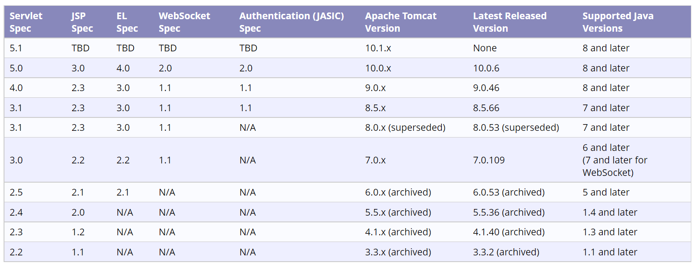

### 安裝 IntelliJ IDEA community

從[官網](https://www.jetbrains.com/idea/download/)上下載回來，我選擇的是 .zip 檔，不用安裝，隨便找個地方擺著就可以了

### 配置 Intellij IDEA 裡的 Tomcat 外掛

開啟 idea，點選左側的 Plugins

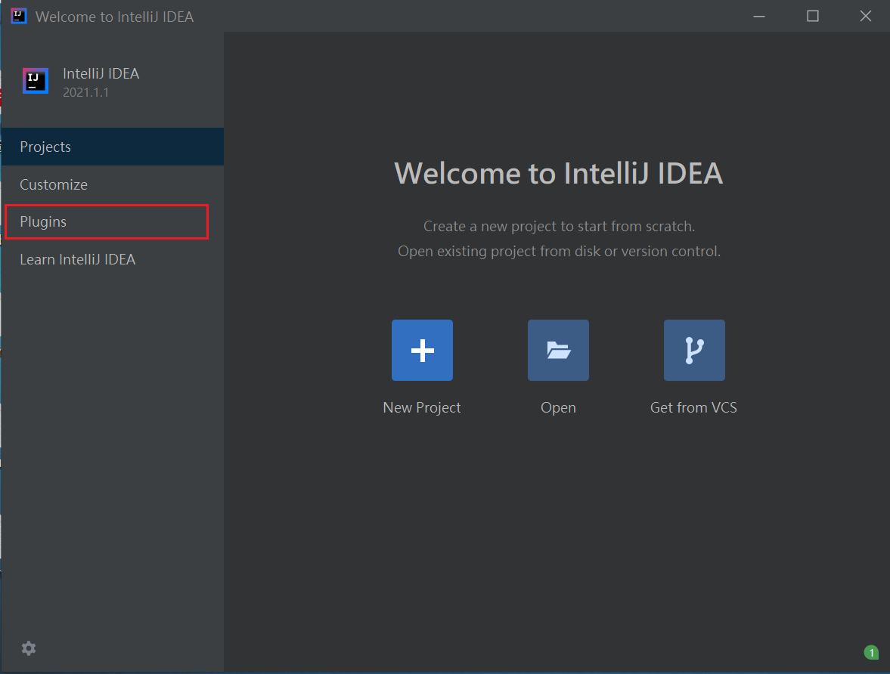

在下圖圈紅色框框處輸入 tomcat，然後就會看到 Smart Tomcat，點選 install，安裝完成後會變成灰色的 Installed，之後再點選左側的 Projects 回到啟始畫面

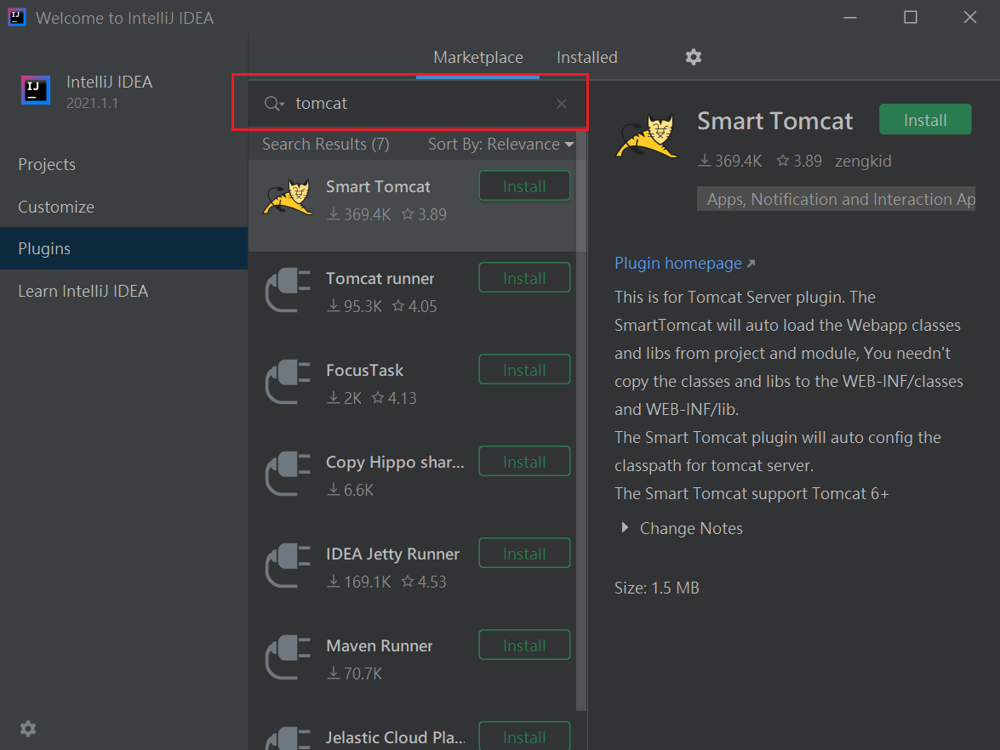

### 建立專案

在 IDEA 的啟始畫面中點選 New Project，接下來的部份至關重要，請務必選擇正確

- 左側選擇 Maven

- Project SDK 確認是否是您已安裝的 JDK 版本

- 勾選 Create from archetype

- 選擇 org.apache.maven.archetypes:maven-archetype-webapp

- 確認底下的敘述是 A simple Java web applicatioin

確認以上無誤後，就點選 Next

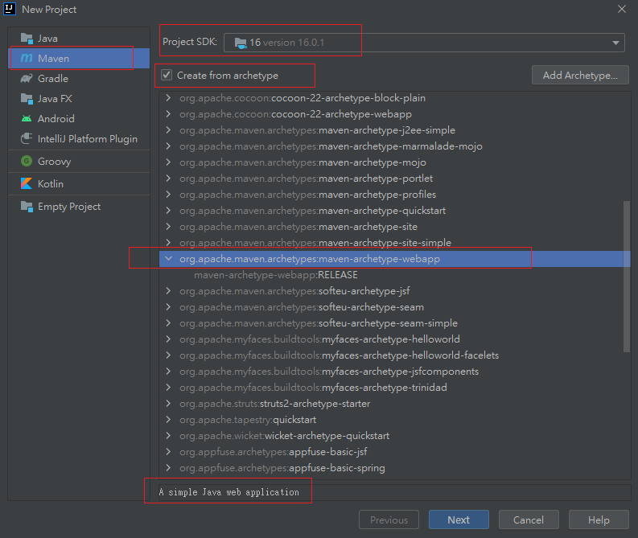

這裡一般就只要填 Name 和 Location 這二項就可以了，填完後點 Next

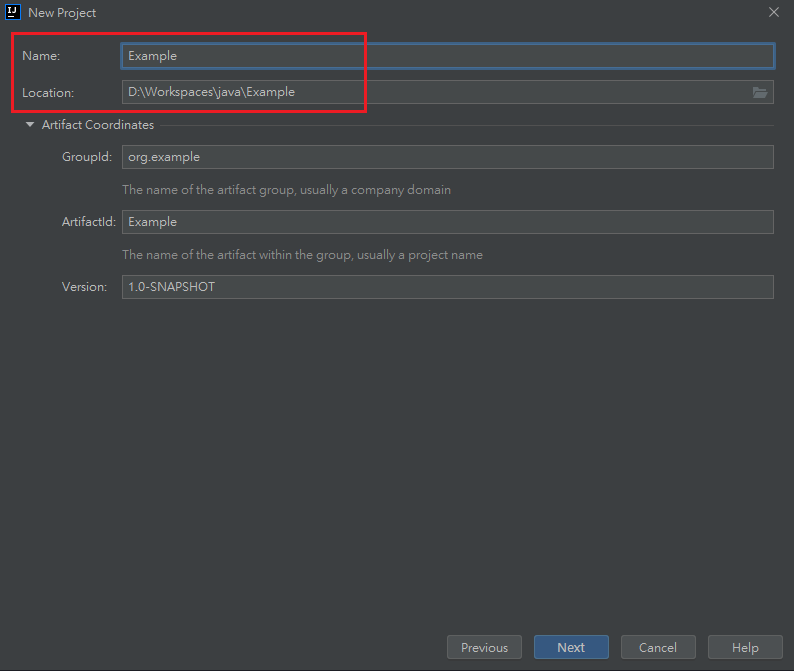

這裡最好是加上一個新的引數，如果不加也可以，只是之後 IDE 在建立專案的過程會非常緩慢(相信我，試過一次後您就會發現還是加上去的好🤣)，完成後點擊 Finish，IDEA 就會開始準備您的專案

```
Name:archetypeCatalog
Value:internal
```

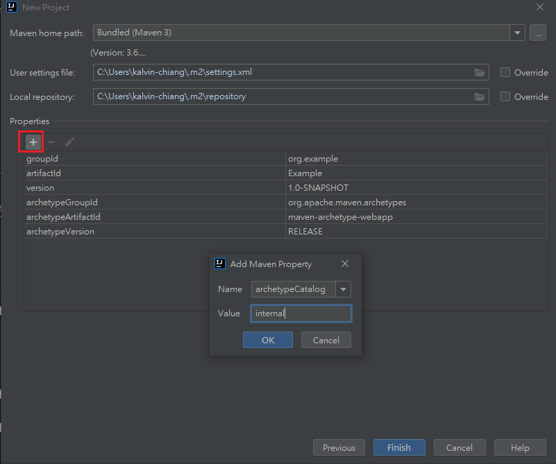

### 配置啟動組態

操作到此，IDEA 已經幫您建置好一個基本的框架了，結構如下圖

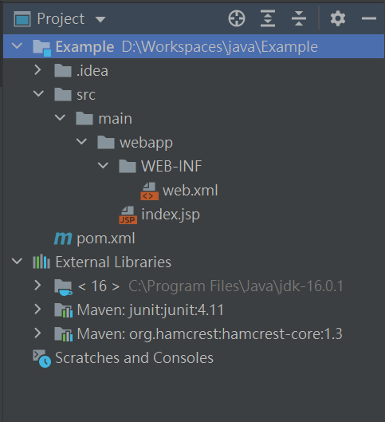

這時候我們要補上一件事，我們要在 main 下方新增一個 Directory，同時還要將它 Mark Directory As Sources Root

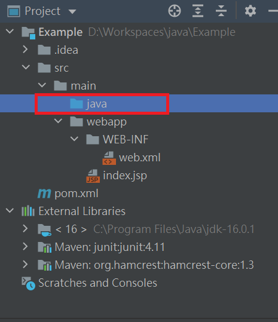

此時工具列上的 Run 是呈現無法點選的狀態，我們必需先去設定好它的組態，點墼 Add Configuration


在 Run/Debug Configurations 頁面左側點選 "+"

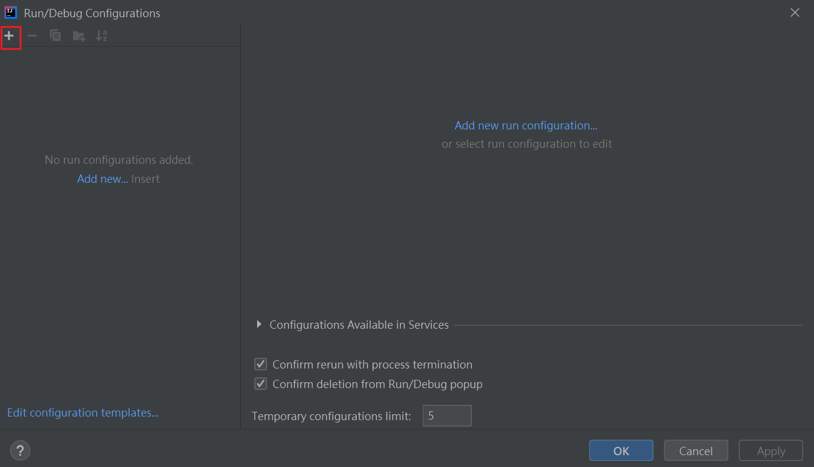

在選單中選擇 Smart Tomcat

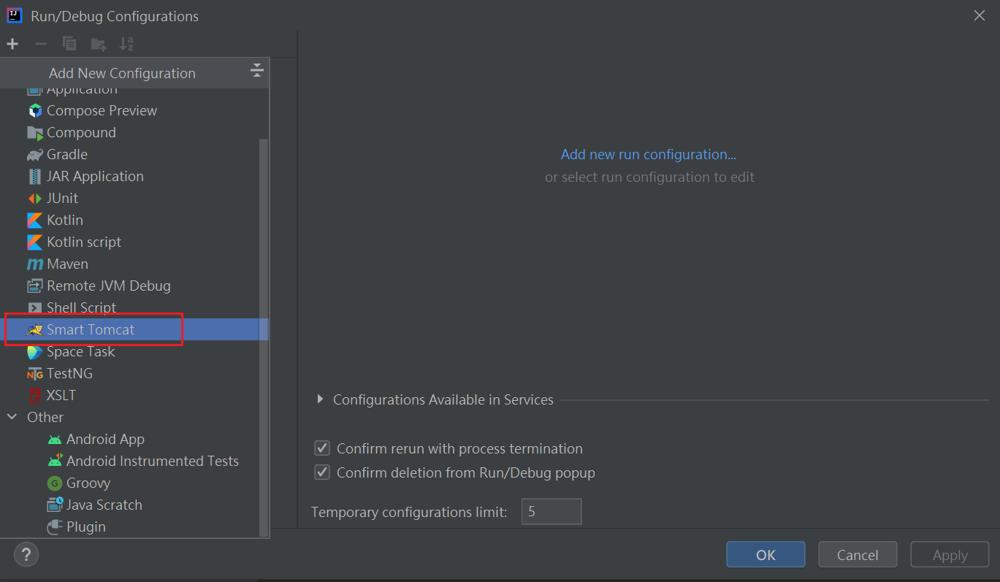

會出現以下畫面，點選 Configuration （注意圖中的說明，如果上一步沒確實完成的話，紅框標示出來的地方會是空白的）

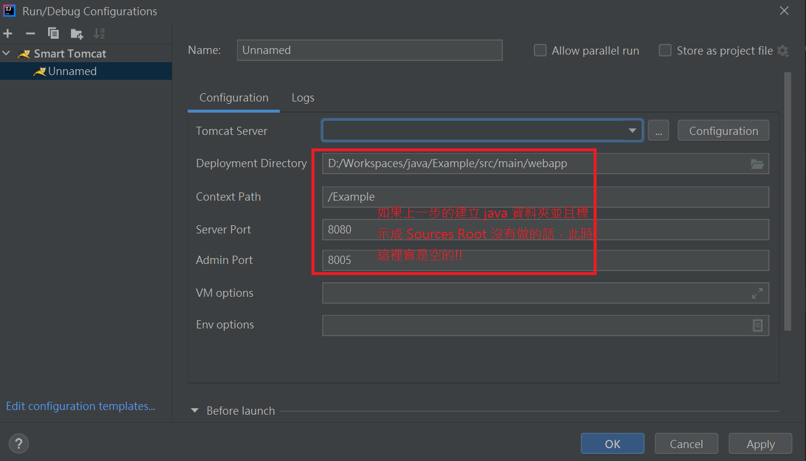

然後會再跳出以下畫面，點選圖中所示的 “+” 號，定位到剛剛我們下載的 tomcat 存放位置，例如我的是 D:\Program Files\tomcat-core\apache-tomcat-9.0.46 後按下 OK

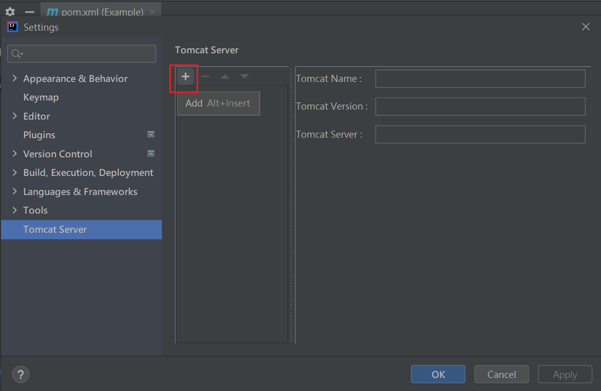

IDEA 會自動辦識內含的 Tomcat 版本，確認後再按下 OK

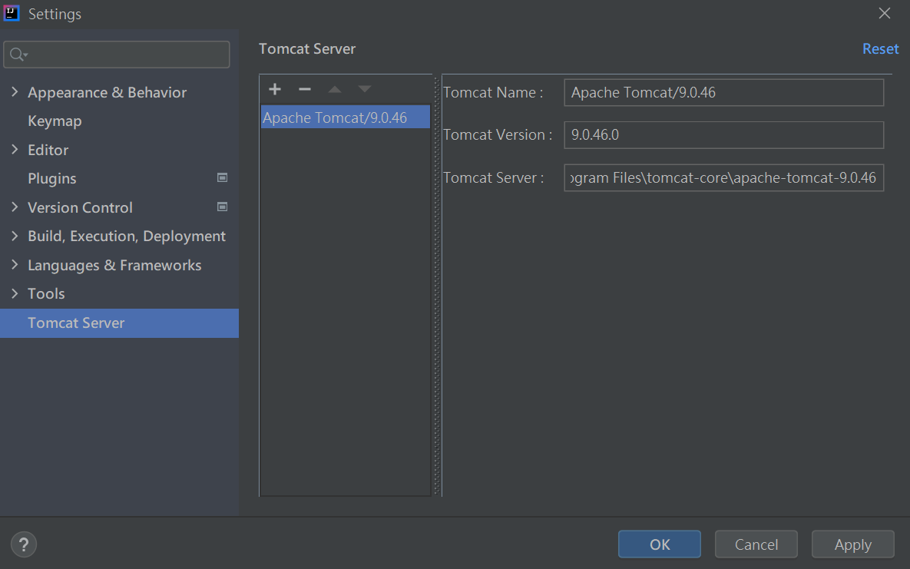

再從下拉選單中選擇我們剛剛加進去組態的 Tomcat 就完成了，為了方便辨識，您可以將此組態設置一個名字，例如我直接設成 Tomcat 9，好了之後按下 OK 即可

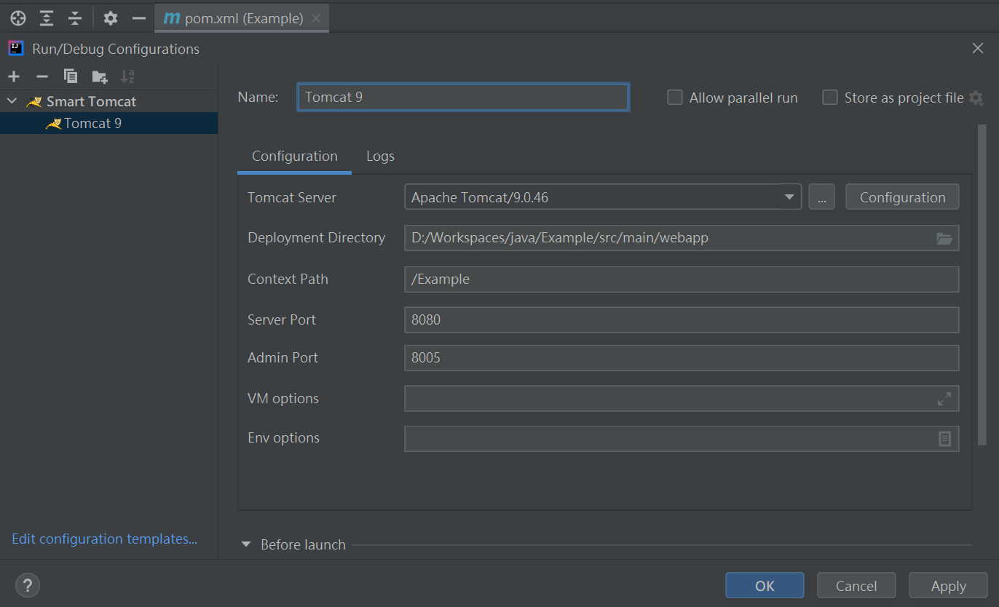

完成後，工具列上已可看到剛剛設置的組態名稱，並且 Run 和 Debug 鈕都是可用的


這時候我們可以按下 Run，建置完成後開啟瀏覽器，在網址列打入

```
http://localhost:8080/Example
```

可以看到以下畫面，就表示成功...一半了，因為這個輸出是 index.jsp 的輸出，而我們要的是 Servlet 可以正常運作

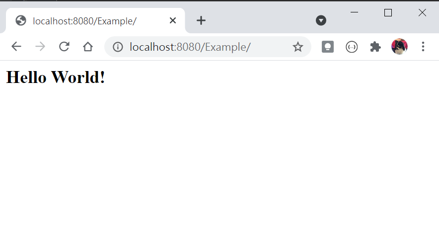

### 將 Servlet 加入依賴

通常我個人的習慣是，只要是和相依性有關的，我一律是加在專案內，而非全域，這是題外話。

因為我們要用的功能是 Servlet，因此要加入 Servlet 的相依性，而我們的專案是用 Maven 建置的，相依性的管理是使用 pom.xml 這份檔案，關於它的相關知識，網路上可以找到很多，這裡就不再贅述了，我們現在要做的是，先到 [MVN Respository](https://mvnrepository.com/artifact/javax.servlet/javax.servlet-api) 找到我們需要的 servlet 版本，點下去後可以看到下面的內容

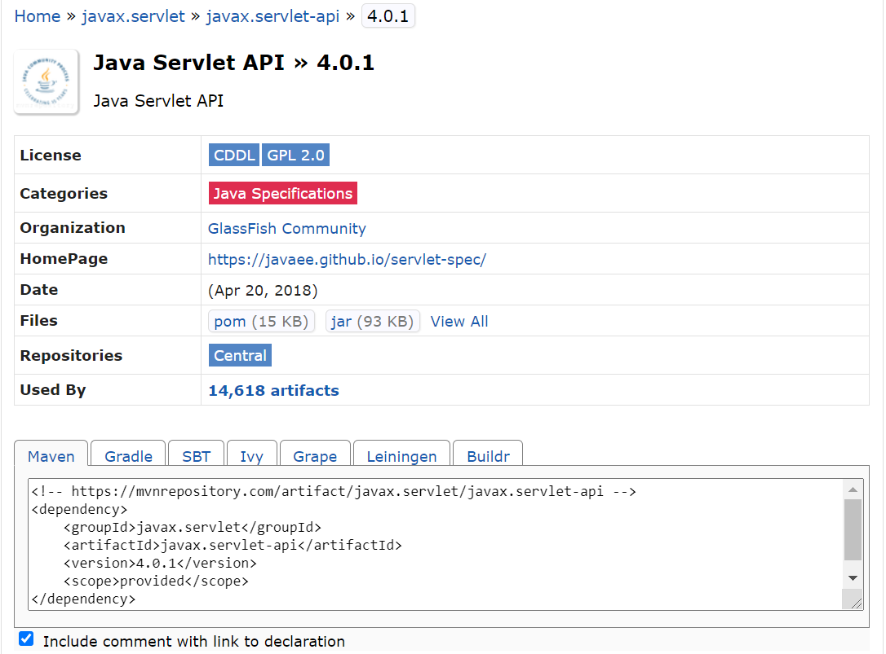

沒錯，我們就是要那段 xml 語句，把它複製下來

```xml
<!-- https://mvnrepository.com/artifact/javax.servlet/javax.servlet-api -->
<dependency>
    <groupId>javax.servlet</groupId>
    <artifactId>javax.servlet-api</artifactId>
    <version>4.0.1</version>
    <scope>provided</scope>
</dependency>

```

貼到 pom.xml 裡的 `</dependency>` 之前，這個時候會出現二個紅色表示 error 的符號，沒關係，點下下方的圖標或是在旁邊的 Maven 工具欄中找到 Reload Project 後就會變成正常

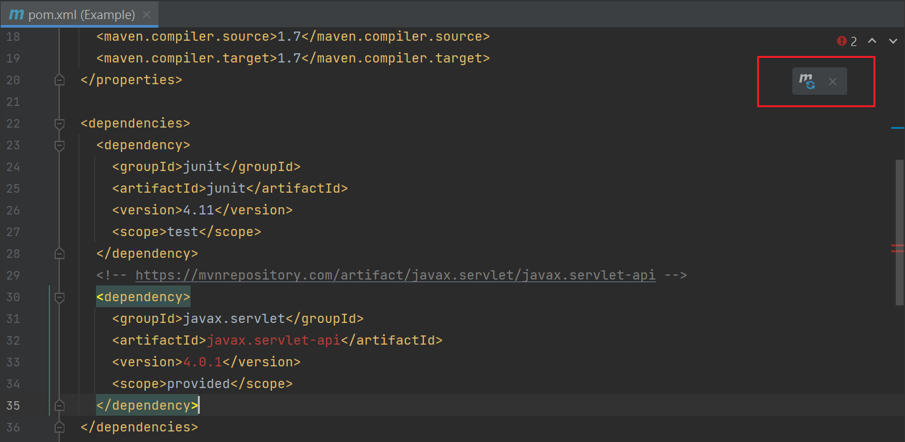

完成後我們還要再做一件事，打開 web.xml，這時候您看到的應該是和我一樣的畫面，這份配置檔在這裡並不是正確的，我們需要一份符合此專案的配置檔，那要到哪兒找呢？其實不難，在剛剛下載的 Tomcat 下就有了，以我的為例，存放的位置就在 D:\Program Files\tomcat-core\apache-tomcat-9.0.46\webapps\ROOT\WEB-INF 底下，用裡面的 web.xml 替換掉專案內的即可

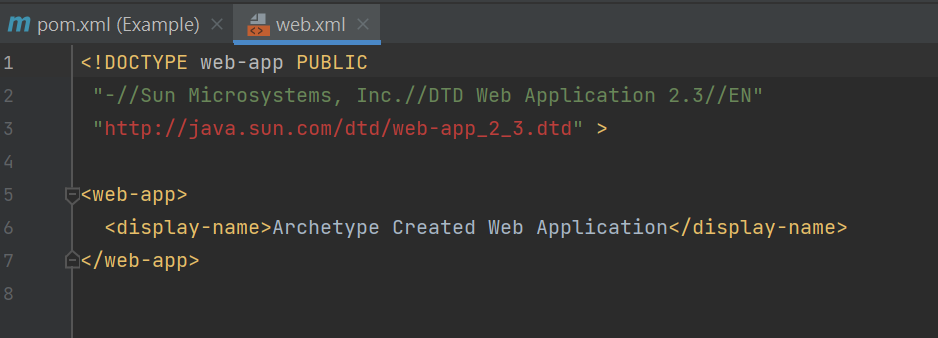

替換後如下圖，但要注意，因為我們前面提到過，在我們的 Servlet 中想要使用 @WebServlet 註解這個功能，因此要把 metadata-complete 由原本的 true 改成 false，至於紅色 error 的部份，在提示中點選 Fetch external resource 即可解決

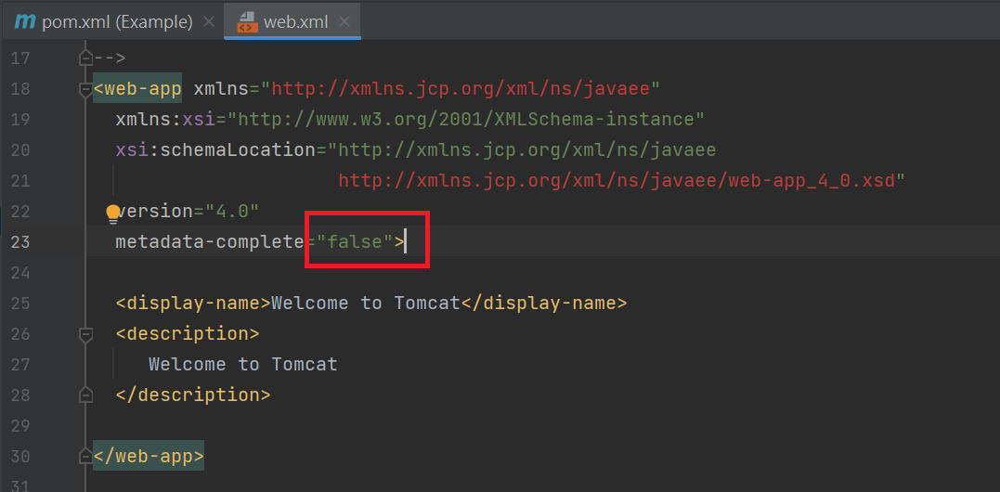

### 撰寫 Servlet 類別

接下來就到了我們的主軸了，在 Project 樹狀結構中找到 java 資料夾，新增 package，這裡以 com.example 為例，再加入 class，名稱為 HelloWorldServlet，將下方的程式碼填入

```java
package com.example;

import javax.servlet.annotation.WebServlet;
import javax.servlet.http.HttpServlet;
import javax.servlet.http.HttpServletRequest;
import javax.servlet.http.HttpServletResponse;
import java.io.IOException;
import java.io.PrintWriter;

@WebServlet(name = "HelloWorldServlet" , urlPatterns="/HelloWorld")

public class HelloWorldServlet extends HttpServlet {
    @Override
    protected void doGet(HttpServletRequest request,
                         HttpServletResponse response)
            throws IOException {
        response.setContentType("text/html");
        PrintWriter out = response.getWriter();
        out.println("<h3>Hello Servlet!</h3>");
    }
}

```

完成後再按下 Run，開啟二個瀏覽器，一個輸入 `http://localhost:8080/Example` 另一個則為 `http://localhost:8080/Example/HelloWorld` 後應該可以看到以下畫面，一個是 index.jsp 輸出，另一個是 Servlet 輸出，到此也就大功告成，接下來我們就可以此為框架繼續我們的開發了

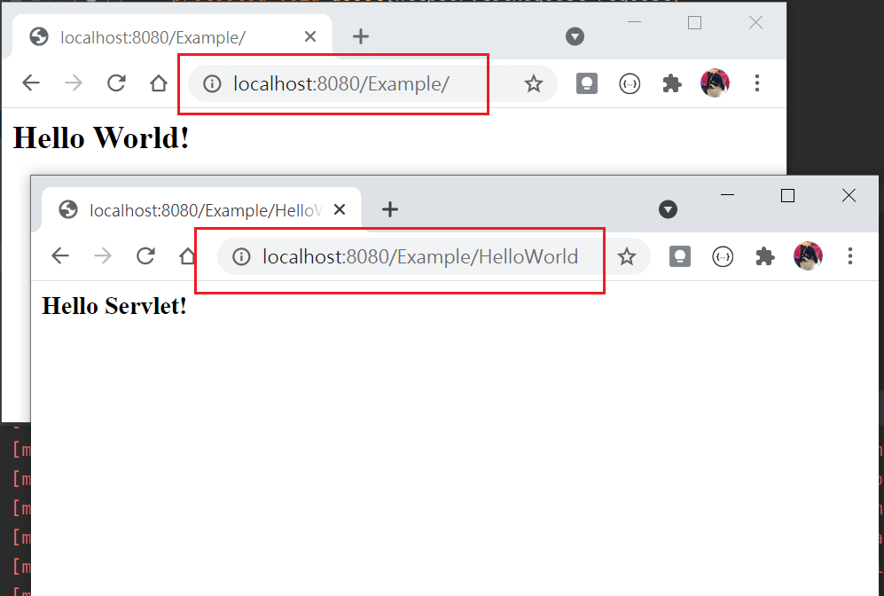

### 範例原始碼

[https://github.com/Kalvin-Chiang/Simple-Servlet-40](https://github.com/Kalvin-Chiang/Simple-Servlet-40)

